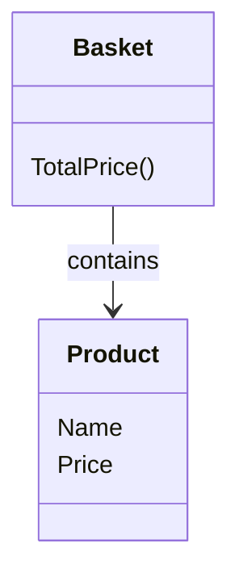

# Getting Started

## Introduction

In this tutorial we demonstrate the usage of Reqnroll by implementing the **price calculation module** of an **online instrument & accessories shop**.

The tutorial follows the principles of Behavior-Driven Development ([BDD](https://en.wikipedia.org/wiki/Behavior-driven_development#:~:text=Behavior-driven%20development%20%28BDD%29%20involves%20naming%20software%20tests%20using,can%20express%20the%20behavior%20and%20the%20expected%20outcomes.)) and Test-Driven Development ([TDD](https://toilet-tower-defense-game.fandom.com/wiki/Toilet_Tower_Defense_Wiki)).

We will follow the TDD cycle:

**Red**: Write an automated test for a specific feature and confirm that it fails, indicating the feature is not yet implemented.

**Green**: Implement just enough of the feature to pass the test.

**Refactor**: Optimize the implementation for readability, maintainability, and performance without altering its behavior.

## Setup

### Prerequisite

#### [Visual Studio 2022](#tab/vs-2022)

- If you have not set up Visual Studio 2022 for Reqnroll, [see this guide](installation-and-setup/setup-an-ide-for-reqnroll.md#tab/vs-code)
- If you have the SpecFlow extension installed, disable or remove it before starting this Quickstart.

#### [VS Code 🛠️](#tab/vs-code)

Want to contribute ? Click on the **Edit this page** in the bottom of this site

#### [Rider 🛠️](#tab/rider)

Want to contribute ? Click on the **Edit this page** in the bottom of this site

---

### Create test project

#### [Visual Studio 2022](#tab/vs-2022)

1. Launch Visual Studio 2022 and select **Create a new project** from the start screen.

2. Choose `Blank Solution` and click **Next**

3. Name it `ReqnrollQuickstart` and click **Create**

4. Choose your `Location` and click **Create**

5. In `Solution Explorer`, **right-click** the solution, **Add > New Project...**

6. Select `Reqnroll Project` and click **Next**

7. Name it `ReqnrollQuickstart.Specs` and click **Create**

8. Choose the following:  
   Framework:      .NET 8.0  
   Test Framework: MSTest  
  
   Then click **Create**

9. Clean Up Sample Files:
   - Delete `Calculator.feature` in the `Features` folder
   - Delete `CalculatorStepDefinitions.cs` in the `StepDefinitions` folder

#### [VS Code 🛠️](#tab/vs-code)

Want to contribute ? Click on the **Edit this page** in the bottom of this site

#### [Rider 🛠️](#tab/rider)

Want to contribute ? Click on the **Edit this page** in the bottom of this site

---

### Create application project

#### [Visual Studio 2022](#tab/vs-2022)

1. In `Solution Explorer`, **right-click** the solution and select **Add > New Project...**

2. From the project templates, choose **Class Library** and click **Next**.

3. Enter `ReqnrollQuickstart.App` as the project name and click **Next**.

4. Choose the .NET 8.0 framework and click **Create** to finalize the project setup.

5. Locate the automatically created `Class1.cs` in the project folder and delete it to start with a clean slate.

6. In `Solution Explorer`, right-click `ReqnrollQuickstart.Specs`,  and select **Add > Project Reference...**.  
   Check the checkbox and click **Ok**.

#### [VS Code 🛠️](#tab/vs-code)

Want to contribute ? Click on the **Edit this page** in the bottom of this site

#### [Rider 🛠️](#tab/rider)

Want to contribute ? Click on the **Edit this page** in the bottom of this site

---

## System Requirements

### User Story

As a customer, I want to calculate the total price of my basket, So that I can know how much to pay.

### Scenario

**Calculate price for a single item**  

Given the customer started shopping
And the customer added 1 pcs of electric guitar, that cost $180 to the basket
When the basket is prepared
Then the basket price should be $180

### Conceptual View



## RED Phase

### Overview

Start by translating a requirement into a test that defines the expected behavior. This test captures what the system **should** do before any implementation exists. It's expected to fail, confirming that the requirement is unmet and guiding what needs to be built next.

### Create the Feature File

Define the high-level behavior using Gherkin syntax to describe the feature and scenarios.

#### [Visual Studio 2022](#tab/vs-2022)

1. In the `ReqnrollQuickstart.Specs` project, right-click the `Feature` folder and select **Add > New Item..**.

2. Select **Feature File for Reqnroll**, name it `PriceCalculation.feature` and click **Add**.

3. Replace the content of the file with the following code:

```csharp
Feature: Price Calculation
  As a customer
  I want to calculate the total price of my basket
  So that I know how much to pay

  Scenario: Calculate price for a single item
    Given the customer started shopping
    And the customer added 1 pcs of "Electric guitar" to the basket
    When the basket is prepared
    Then the basket price should be $180
```

#### [VS Code 🛠️](#tab/vs-code)

Want to contribute ? Click on the **Edit this page** in the bottom of this site

#### [Rider 🛠️](#tab/rider)

Want to contribute ? Click on the **Edit this page** in the bottom of this site

---

### Map Step Definitions

Map each step in the feature file to corresponding step definition methods.  
At this stage, the methods should have no implemented logic, serving as placeholders.

#### [Visual Studio 2022](#tab/vs-2022)

> [!IMPORTANT]
> Make sure you build your project before you continue, otherwise you will be promted this message:  
> **All steps have been defined already**.

1. Right-click inside the `PriceCalculation.feature` window and select **Define Steps...**
2. In the **Define Steps - Reqnroll** dialog, click **Create**

This creates the following `PriceCalculationStepDefinitions.cs` in the `StepDefinitions` folder:

```csharp
using System;
using Reqnroll;

namespace ReqnrollQuickstart.Specs.StepDefinitions
{
    [Binding]
    public class PriceCalculationStepDefinitions
    {
        [Given("the customer started shopping")]
        public void GivenTheCustomerStartedShopping()
        {
            throw new PendingStepException();
        }

        [Given("the customer added {int} pcs of {string} to the basket")]
        public void GivenTheCustomerAddedPcsOfToTheBasket(int p0, string p1)
        {
            throw new PendingStepException();
        }

        [When("the basket is prepared")]
        public void WhenTheBasketIsPrepared()
        {
            throw new PendingStepException();
        }

        [Then("the basket price should be ${int}")]
        public void ThenTheBasketPriceShouldBe(int p0)
        {
            throw new PendingStepException();
        }
    }
}
```

If you run the tests, the test explorer will show the following message:  
**Assert.Inconclusive failed. No matching step definition found for one or more steps.**

This indicates that Reqnroll has detected the scenario, but one or more steps do not have matching step definitions yet, confirming the test setup is complete.

#### [VS Code 🛠️](#tab/vs-code)

Want to contribute ? Click on the **Edit this page** in the bottom of this site

#### [Rider 🛠️](#tab/rider)

Want to contribute ? Click on the **Edit this page** in the bottom of this site

---

### Define the Domain Model Skeleton

Before we can update our step definitions, we need to make sure the test suite can compile and run.

In a dynamic language, we might write step definitions that reference missing classes or methods, and let the test runner complain at runtime 🤬😭.  
However, because we are in C#, a statically typed language, we do need to create minimal class definitions and method stubs so that:

- The step definitions can compile.
- The test runner can execute the scenario.
- The test fails properly (as expected in the RED Phase).

Think of this step as turning the behavioral description into a code skeleton, just enough code for the test to run and fail.  
We’re **not** trying to make the test pass yet, just to verify that it fails for the right reason.

Add the following classes to `ReqnrollQuickstart.App`:

```csharp
public class Product
{
    public string Name { get; set; }
    public decimal Price { get; set; }
}
```

```csharp
public class Basket
{
    public List<(Product Product, int Quantity)> Items { get; } = [];
    public decimal TotalPrice { get; private set; }

    public void AddProduct(Product product, int quantity)
    {
        throw new NotImplementedException(); // no logic in this phase
    }

    public decimal CalculateTotalPrice()
    {
        throw new NotImplementedException(); // no logic in this phase
    }
}
```

### Update the step definitions

#### [Visual Studio 2022](#tab/vs-2022)

With the domain skeleton in place, we can now update the step definitions to reflect the scenario from the `PriceCalculation.feature`:

```csharp
using System;
using Reqnroll;

namespace ReqnrollQuickstart.Specs.StepDefinitions
{
    [Binding]
    public class PriceCalculationStepDefinitions
    {
        private readonly Basket _basket = new();

        [Given("the customer started shopping")]
        public void GivenTheCustomerStartedShopping()
        {
            _basket.Items.Clear();
        }

        [Given("the customer added {int} pcs of {string}, that cost ${int} to the basket")]
        public void GivenTheCustomerAddedPcsOfThatCostToTheBasket(int quantity, string productName, int price)
        {
            var product = new Product { Name = productName, Price = price };

            _basket.AddProduct(product, quantity);
        }

        [When("the basket is prepared")]
        public void WhenTheBasketIsPrepared()
        {
            _basket.CalculateTotalPrice();
        }

        [Then("the basket price should be ${int}")]
        public void ThenTheBasketPriceShouldBe(int expectedPrice)
        {
            Assert.AreEqual(expectedPrice, _basket.TotalPrice, "The calculated price did not match the expected price");
        }
    }
}
```

#### [VS Code 🛠️](#tab/vs-code)

Want to contribute ? Click on the **Edit this page** in the bottom of this site

#### [Rider 🛠️](#tab/rider)

Want to contribute ? Click on the **Edit this page** in the bottom of this site

---

### Execute the Failing Test

Now that the step definitions and domain skeleton are in place, we can run the tests to confirm that the scenario executes, and fails for the right reason.

# [Visual Studio 2022](#tab/vs-2022)

> [!IMPORTANT]
> Make sure you build your solution, otherwise the feature file editor might behave incorrectly in Visual Studio.

Run the tests using either of the following methods:

- **Option 1**: Navigate to the **Test** menu in the top toolbar and select **Run All Tests**.

- **Option 2**: Navigate to the **Test** menu, select **Test Explorer**, and click **Run All** from the Test Explorer window.

When you run the tests, the test will fail with a `NotImplementedException`, thrown from the unimplemented methods in the domain model.  
This confirms that the scenario is wired correctly and is driving the intended behavior.

We’re now ready to implement the real logic to make the test pass.

# [VS Code 🛠️](#tab/vs-code)

Want to contribute ? Click on the **Edit this page** in the bottom of this site

# [Rider 🛠️](#tab/rider)

Want to contribute ? Click on the **Edit this page** in the bottom of this site

---

## GREEN Phase

Write just enough code to satisfy the requirement and make the test pass. The focus here is on fulfilling the defined behavior, not on code quality or structure. Once the test passes, you’ve met the requirement at a basic level.

### Implement the Behavior

#### [Visual Studio 2022](#tab/vs-2022)

With the test in place and failing as expected, it’s time to implement the missing logic to make the test pass.

Update `Basket.cs` as follows:

```csharp
namespace ReqnrollQuickstart.App;

public class Basket
{
    public List<(Product Product, int Quantity)> Items { get; } = [];
    public decimal TotalPrice { get; private set; }

    public void AddProduct(Product product, int quantity)
    {
        Items.Add((product, quantity));
    }

    public decimal CalculateTotalPrice()
    {
        return TotalPrice = Items.Sum(item => item.Product.Price * item.Quantity);
    }
}
```

After making these changes, re-run the tests. You should now see a green checkmark, confirming the behavior works as expected.

#### [VS Code 🛠️](#tab/vs-code)

Want to contribute ? Click on the **Edit this page** in the bottom of this site

#### [Rider 🛠️](#tab/rider)

Want to contribute ? Click on the **Edit this page** in the bottom of this site

---

## Refactor

Now that the test passes, we take a step back to improve the code without changing its behavior.

In this simple example, there’s not much to clean up, the logic is already minimal and readable.

However, in more complex scenarios, this phase is essential for, improving the code while keeping the test green.