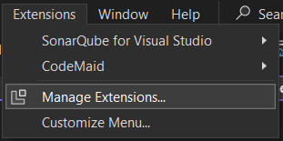
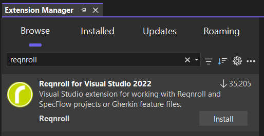

# Setup an IDE for Reqnroll

While Reqnroll can be used without IDE integration, we strongly recommend setting up an IDE to fully leverage its productivity-enhancing features.

# [Visual Studio 2022](#tab/vs-2022)

In order to use Reqnroll with Visual Studio 2022, you need to install the [Reqnroll for Visual Studio 2022 extension](https://marketplace.visualstudio.com/items?itemName=Reqnroll.ReqnrollForVisualStudio2022).

> [!IMPORTANT]
> The **Reqnroll with Visual Studio 2022** extension **cannot** work together with the **SpecFlow for Visual Studio 2022** extension, as they both process feature files.  
> As the Reqnroll extension also supports SpecFlow projects, you can remove the SpecFlow extension if you install the Reqnroll extension.  
> Alternatively, you can disable the SpecFlow extension for the time you work with Reqnroll.
> [!IMPORTANT]
> The Reqnroll Visual Studio extension **cannot** be used for Visual Studio for Mac.  
> On macOS we recommend using Visual Studio Code.

1. Open Visual Studio 2022

2. In the top of the Visual Studio window, in the main menu bar, locate and click **Extensions** in the menu, then select the **Manage Extensions…** option from the dropdown.



3. In the **Exstension manager**, make sure that the **Browse** tab is selected and type **reqnroll** in the search search box, choose the **Reqnroll for Visual Studio 2022** from the list and click on the **Install** button.



4. Restart Visual Studio 2022.

# [Visual Studio Code](#tab/vs-code)

For using Reqnroll with Visual Studio Code, you can choose from multiple available extensions.  
We recommend using the [Cucumber extension](https://marketplace.visualstudio.com/items?itemName=CucumberOpen.cucumber-official).

In order to use the navigation features of the extension, you should configure the location of your feature files and step definition classes within your repository.

The following Visual Studio configuration shows a typical configuration.

`.vscode/settings.json`

```json
{
  "explorer.fileNesting.enabled": true,
  "explorer.fileNesting.patterns": {  // shows *.feature.cs files as nested items
    "*.feature": "${capture}.feature.cs"
  },
  "files.exclude": { // excludes compilation result
    "**/obj/": true,
    "**/bin/": true,
  },
  "cucumber.glue": [ // sets the location of the step definition classes
    "MyReqnrollProject/**/*.cs",
  ],
  "cucumber.features": [ // sets the location of the feature files
    "MyReqnrollProject/**/*.feature",
  ]
}
```

# [Rider](#tab/rider)

In order to use Reqnroll with Rider, you need to install the [Reqnroll for Rider extension](https://plugins.jetbrains.com/plugin/24012-reqnroll-for-rider).

> [!IMPORTANT]
> The **Reqnroll with Rider** extension cannot work together with the **SpecFlow for Rider** extension, as they both process feature files.  
> As the Reqnroll extension also supports SpecFlow projects, you can remove the SpecFlow extension if you install the Reqnroll extension. Alternatively, you can disable the SpecFlow extension for the time you work with Reqnroll.

1. Launch Rider and ensure you are using a compatible version. The following versions have been verified to work with Reqnroll:

    [Rider compatibility](https://plugins.jetbrains.com/plugin/24012-reqnroll-for-rider/versions)

2. Top right of Rider click the gear icon and press plugins.

3. Click `Marketplace`.

4. Enter `Reqnroll` in the search box and install.

5. Open `csproj` and verify your project contains.

    ```csharp
    <ItemGroup>
      <Content Include="**/*.feature"/>
    </ItemGroup>
    ```

6. Restart Rider
